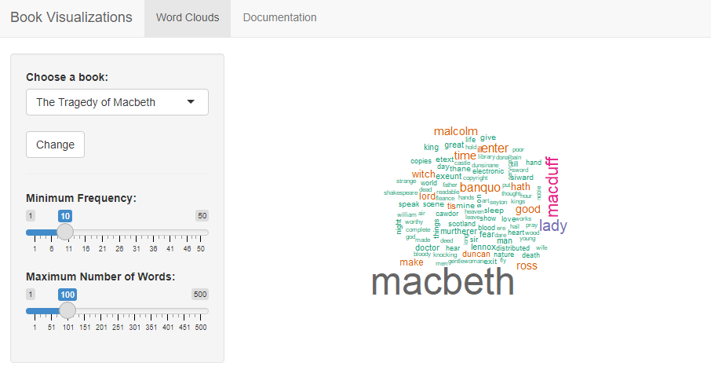

```{r setup, include=FALSE}
knitr::opts_chunk$set(echo = FALSE)
```

## Book Visualizations App

This application is intended to provide some general insight on the contents of some books using word clouds.
Word clouds are graphical representations of word that appear more frequently in a source text.

- Shiny Application Link: https://hanifnoer.shinyapps.io/books_world_cloud/
- Repository Link: https://github.com/hanifnoerr/Shiny_app

## List of the books

- The Tragedy of Macbeth, by William Shakespeare
- A Tale of Two Cities, by Charles Dickens
- The Adventures of Sherlock Holmes, by Arthur Conan Doyle
- Alice in Wonderland, by Lewis Carroll
- A Journal of the Plague Year, by Daniel Defoe

## How to use

1. Choose a book (default view is The Tragedy of Macbeth, by William Shakespeare with 100 number of unique words and have minimum 10 frequency).
2. Adjust 'minimum frequency' and 'maximum number of words' as desired. The results are real time.
3. If you want to change a book, select the book first and then click change.

## Source code
This Shiny application consist of 3 files:

- global.R
- server.R
- ui.R


## User Interface
This is the UI of Book Visualizations App

```{r, echo=FALSE}
   
```

